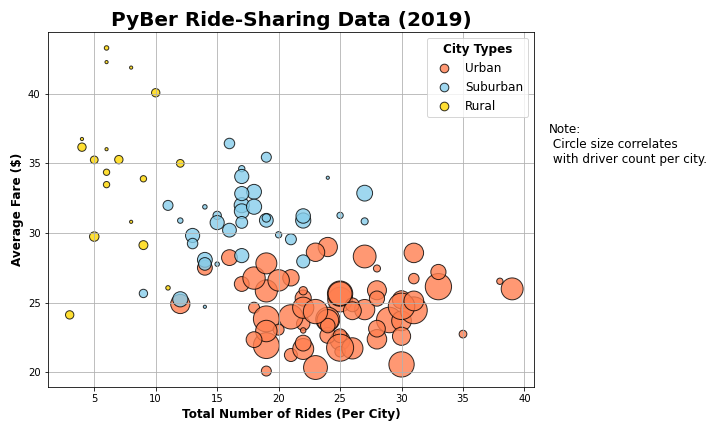
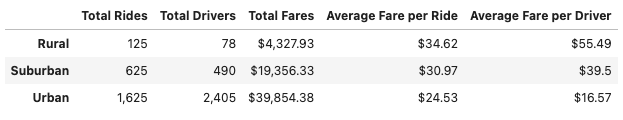
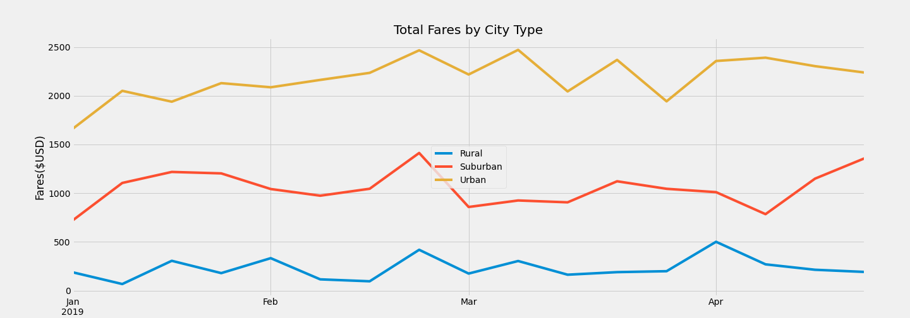
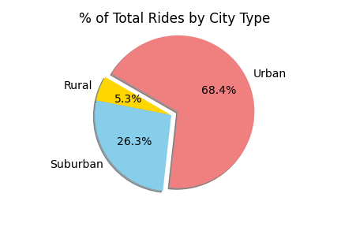
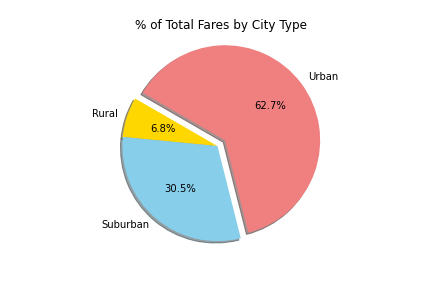

# Pyber_Ridesharing_Analysis

## Overview
Analyze all the rideshare data from January to early May of 2019, and create visualizations, using Matplotlib, of rideshare data for PyBer to help improve access to ride-sharing services.

## Results
#### Summary Overview 

This table shows summary totals for the CyBer ridesharing data.  The logical assumption that rural areas would have less customers and drivers than the suburban areas runs true with in this data set. The same is true with suburban versus urban. This is better illustrated by the bubble chart below.

#### Bubble Chart by city type

## Summary
Looking at the data there are 3 recommendations that can be made for business and marketing improvements. 
- Although Rural fares count for 6.8% (seen in pie chart below) the average fare is ~ $10 more per Ride and $40 more per driver.  For this segment we can leverage more marketing towards drivers of new rural areas. 

- Urban areas on the other hand, with more drivers and more competition with public transport and other ridesharing companies. Leveraging “gamification” for customers with incentives for frequent use of PyBer ridesharing.

- Suburban segment, could be the most profitable segment due to the higher number rides than the rural segment but a proportionally higher average fare to the urban segment. Visually you can see this with these pie charts below.
 

